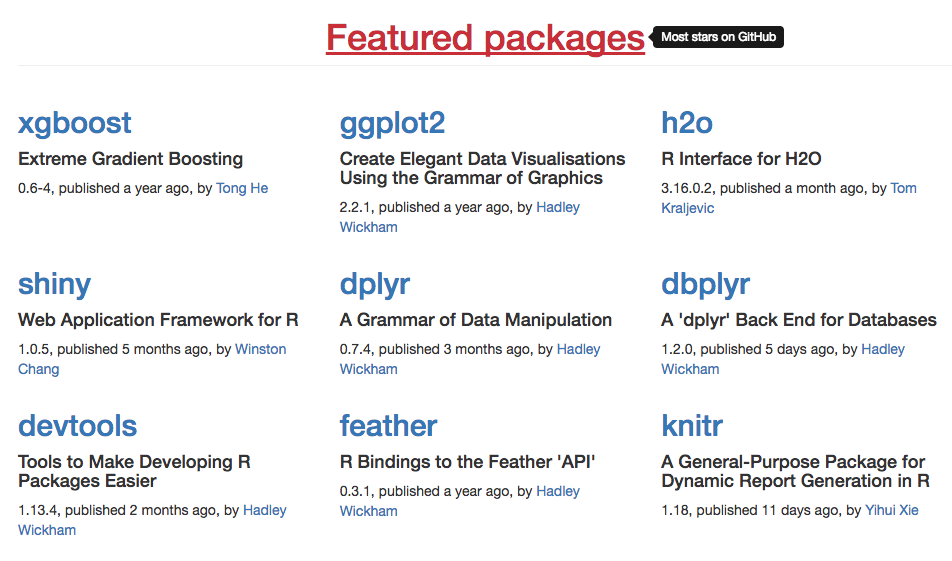
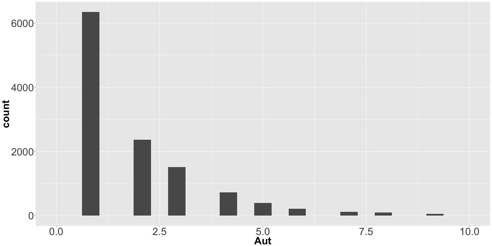
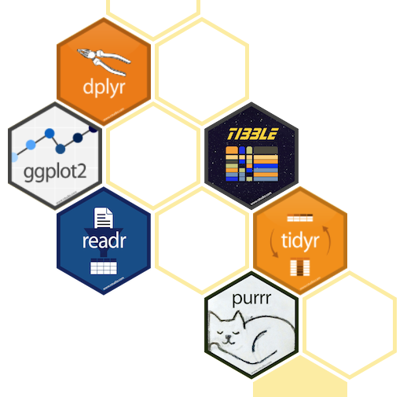

What Makes a Great R Package?
========================================================
author: Joseph Rickert
date: February 3, 2018
autosize: true

CRAN: The Home of Hidden Treasures
========================================================

12,000 + Packages


GitHub: A Destination for R Packages
========================================================
>"There is no benefit to having a package on CRAN"  
Richard McElreath in "Statistical Rethinking"     

METACRAN
  

Types of R Packages
=========================================================
By function:   
* Data
* Data Science
* Science 
* Statistics
* Utilities

By intended use:  
* Public  
* Private  
   + Personal   
   + Professional  

Good R Packages:
========================================================
* Do something that people other than the author might consider useful   
* Offer enough functionality to make it worth remembering   
* Are well documented with both:   
   + Complete reference manuals that included scientific references   
   + Thoughtful vignettes   
* Work   
* Are well maintained   

The Best R Packages:
=========================================================
* Are well written, tested and provide helpful messages 
* Have champions who actively promote, explain and teach their use   
* Are likely curated by others (R Task Views)   
* Used by other developers   

* Great R Pakages
=========================================================
* Add new functionality and capabilities    
* Develop new infrastructure   
* Improve performance    
* Change the way people think about R   
* Expand the reach of R  
* Do something beautiful


Reverse Dependencies and Reverse Imports
========================================================

```r
load(file="pkg_counts.RDA")
head(pkg_counts[,c(1,2,7,8)],15)
```

```
      Package Aut DepImp RDRI
1        Rcpp   7      3 1220
2        MASS   6      6 1142
4     ggplot2   3     11 1126
5       dplyr   5     12  684
6      Matrix  13      7  666
8        plyr   1      2  553
9     stringr   2      3  487
10    mvtnorm   9      3  479
11   magrittr   1      0  432
12   survival   2      7  425
14       httr   2      6  409
15   jsonlite   3      1  409
16         sp   9      8  407
17    lattice   1      6  393
19 data.table   6      2  379
```

Some Simple Stats
========================================================


```r
sapply(pkg_counts[-1],ss)
```

```
       Aut  Dep  Imp  RD   RI    DepImp RDRI
mean   2.23 1.53 2.81 0.7  2.09  4.35   2.79
sd     2.69 1.58 3.87 7.37 21.25 4.06   27.2
median 1    1    1    0    0     3      0   
```

Reverse Depends and Imports
========================================================

```r
quantile(pkg_counts$RDRI)
```

```
  0%  25%  50%  75% 100% 
   0    0    0    0 1220 
```


Collaboration
=========================================================

```r
quantile(pkg_counts$Aut)
```

```
  0%  25%  50%  75% 100% 
   1    1    1    3   97 
```




Alternatives to the "Great" Package
========================================================
Families of intergrated packages
* [ROpenSci](https://ropensci.org/)
* [statnet](http://www.statnet.org/)
* [Tidyverse](https://www.tidyverse.org/)    



For more details on authoring R presentations please visit <https://support.rstudio.com/hc/en-us/articles/200486468>.


