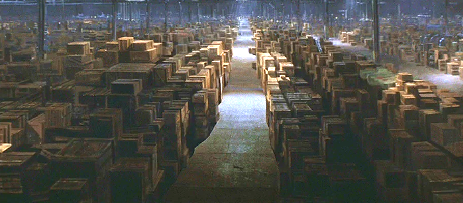
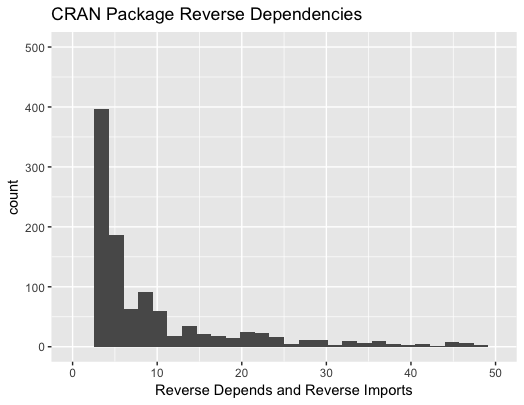
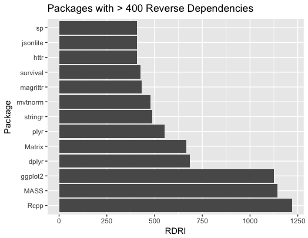

What makes a great R Package?
========================================================
author: Joseph Rickert
date: February 3, 2018
autosize: true

CRAN: The Home of Hidden Treasures
========================================================

12,000 + Packages



Reverse Dependencies and Reverse Imports
========================================================
The average number of reverse dependencies and reverse imports for a CRAN package is 3.1

The quantiles look like this:

```r
50%  60%  70%  80%  90% 100% 
 0    0    0    1    2  1220 
```   



Most Integrated R Packages
========================================================



For more details on authoring R presentations please visit <https://support.rstudio.com/hc/en-us/articles/200486468>.

- Bullet 1
- Bullet 2
- Bullet 3

Slide With Code
========================================================


```r
summary(cars)
```

```
     speed           dist       
 Min.   : 4.0   Min.   :  2.00  
 1st Qu.:12.0   1st Qu.: 26.00  
 Median :15.0   Median : 36.00  
 Mean   :15.4   Mean   : 42.98  
 3rd Qu.:19.0   3rd Qu.: 56.00  
 Max.   :25.0   Max.   :120.00  
```

Slide With Plot
========================================================


