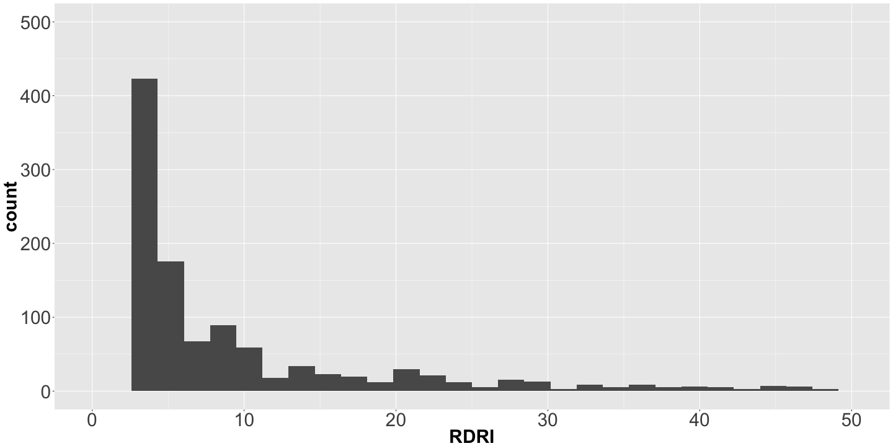
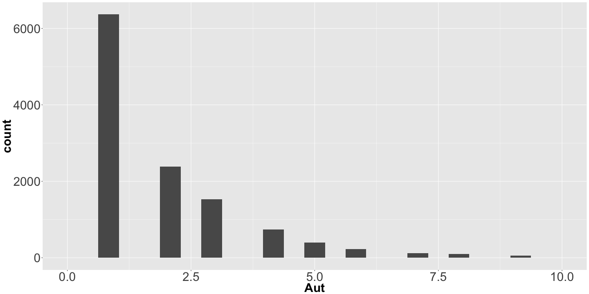

What Makes a Great
========================================================


    
# Package?

Joseph Rickert     
February 3, 2018     


CRAN: The Home of Hidden Treasures
========================================================

12,000 + Packages


Disenchantment with CRAN?
========================================================
>"There is no benefit to having a package on CRAN"  
     
>Richard McElreath in "Statistical Rethinking"     

>


GitHub is gaining ground
=========================================================
METACRAN
  


How many CRAN Packages are valuable?
========================================================
   

***   

At least about 1/4!
* 35 Task Views
* All curated by experts
* Containing 2,960 packages 

After more than a year of looking at all new packages on CRAN each month I think that percentage of valuable packages is much higher!


CRAN == Statistical Knowledge
==============================================================
CRAN is the worlds largest most complete repository of statistical computing knowledge.


Types of R Packages
=========================================================
By application domain:
* Computational Methods
* Data
* Data Science
* Machine Learning
* Science 
* Statistics
* Utilities

***

By intended use:  
* Public  
* Private  
   + Personal   
   + Professional  

Professional Packages
=======================================================
e.g. [clindr](https://CRAN.R-project.org/package=clinDR)   

   

***

* References behind paywall
* No vignette
* No README
* Looks like quite a bit of work went into it
   * Numerous functions
   * Parallel execution


Good R Packages:
========================================================
* Do something that people other than the author might consider useful   
* Offer enough functionality to make it worth remembering   
* Are well documented with both:   
   + Complete reference manuals that included references
   + README and NEWS files
   + Thoughtful vignettes   
* Work   
* Are well maintained   

The Best R Packages:
=========================================================
* Are well written, tested and provide helpful messages 
* Have champions who actively promote, explain and teach their use   
* Are likely curated by others (R Task Views)   
* Used by other developers   

Great R Packages:
=========================================================
* Add new functionality and capabilities    
* Develop new infrastructure   
* Improve performance    
* Change the way people think about R   
* Expand the reach of R  
* Do something beautiful


My Picks for the R Package Hall of Fame
=========================================================

Package   | Year| Description                         | Author
----------|-----|-------------------------------------|-----------------    
caret     | 2007| A framework for predictive modeling | Kuhn et al.
bigmemory | 2008| Matrices in memory mapped files     | Kane ot al.
data.table| 2006| Fast, big data queries              | Dowle et al.
e1071     | 1999| Machine Learning                    | Meyer et al.
dplyr     | 2014| Tidy data manipulation              | Wickham et al.
foreach   | 2009| Parallel computing                  | Calaway & Weston
forecast  | 2009| Time series forecasting             | Hyndman et al.
ggplot2   | 2007| Plots and Visualizations            | Wickham & Cheng
glmnet    | 2008| lasso, elastic net regularization   | Freidman et al.
Hmisc     | 2003| 157 Misc data analysis & utilities  | Harrell et al.
knitr     | 2012| Literate programming                | Xie et al.
lme4      | 2003| GLM mixed-effects models            | Bates et al.
MASS      | 2009| Fundamental statistical functions   | Ribley et al.
Matrix    | 2000| Matrix Algebra                      | Bates et al.
Rcpp      | 2008| R interface to C++                  | Eddelbuettel et al.
rmarkdown | 2014| Reproducible research               | Allaire et al.
shiny     | 2012| Web apps & reactive programming     | Chang et al.
sp        | 2005| Spatial statistics                  | Pebesma et al.
XML       | 2000| Work with XML & HTML                | Temple Lang et al.
zoo       | 2004| Time Series                         | Zeileis et al.

Contributions of Hall of Fame Packages
========================================================
* To the R Language itself: data.table, XML, bigmemory
* To Statistics: lme4, sp, glmnet, Hmisc
* To Statistical computing: foreach, Rcpp, Matrix, MASS, zoo
* To the display of information: ggplot2
* To machine learning: caret, e1071, forecast
* To reproducible research and the "science of data science": dplyr, knitr, rmarkdown, shiny

> Wickham . . .making tidy data tools available . . .may have more impact on today’s practice of data analysis than many highly regarded theoretical statistics articles.
[Donoho (20i7) *50 Years of Data Science](http://www.tandfonline.com/doi/full/10.1080/10618600.2017.1384734)


Some Simple Package Stats
========================================================


```
[1] 12108     8
```

```
       Aut  Dep  Imp  RD   RI    DepImp RDRI 
mean   2.24 1.52 2.84 0.69 2.12  4.37   2.81 
sd     2.73 1.57 3.88 7.3  21.71 4.06   27.59
median 1    1    1    0    0     3      0    
```


```r
# pdb <- tools:::CRAN_package_db()
load("pdbjan31.RDA")
```


Reverse Depends and Imports Stats
=========================================================
RDRI quantiles

```
  0%  25%  50%  75% 100% 
   0    0    0    0 1239 
```



Top 15 most integrated CRAN Packages
========================================================

```
      Package Aut DepImp RDRI
1        Rcpp   7      3 1239
2        MASS   6      6 1156
4     ggplot2   3     11 1149
5       dplyr   5     12  716
6      Matrix  13      7  678
8        plyr   1      2  555
9     stringr   2      3  500
10    mvtnorm   9      3  483
11   magrittr   1      0  454
12   survival   2      7  433
14   jsonlite   3      1  426
15       httr   2      6  420
16         sp  10      8  405
17    lattice   1      6  398
19 data.table   6      2  396
```


Collaboration
=========================================================
Author quantiles

```
  0%  25%  50%  75% 100% 
   1    1    1    3   97 
```




Some Hall of Fame Stats
========================================================

```
    Package Aut Dep Imp  RD   RI DepImp RDRI
       Rcpp   7   1   2 154 1085      3 1239
       MASS   6   5   1 436  721      6 1156
    ggplot2   3   1  10 280  869     11 1149
      dplyr   5   1  11  50  666     12  716
     Matrix  13   1   6 256  424      7  678
         sp  10   2   6 136  269      8  405
 data.table   6   1   1  65  331      2  396
    foreach   3   1   3  79  277      4  356
      shiny  29   2  10  41  238     12  279
        XML   1   3   0  50  169      3  219
        zoo   5   2   4  62  155      6  217
     glmnet   5   3   1  44  108      4  152
       lme4  10   4  10  46   99     14  145
      Hmisc   2   4  15  42   97     19  139
      knitr  84   1   7  11  117      8  128
      e1071   7   0   6  23   87      6  110
  rmarkdown  36   1  12   1   66     13   67
   forecast   5   1  13  22   41     14   63
      caret  16   3  12  10   48     15   58
  bigmemory   4   1   4  12   16      5   28
```

Alternatives to the "Great" Package
========================================================
Families of intergrated packages
* [ROpenSci](https://ropensci.org/)
* [statnet](http://www.statnet.org/)
* [Tidyverse](https://www.tidyverse.org/)    


For more details on authoring R presentations please visit <https://support.rstudio.com/hc/en-us/articles/200486468>.


